layout: true

<div class="my-footer">
  <span style="text-align:center">
    <span> 
      
    </span>
    <a href="https://therbootcamp.github.io/">
      <span style="padding-left:82px"> 
        <font color="#7E7E7E">
          https://therbootcamp.github.io
        </font>
      </span>
    </a>
    <a href="https://therbootcamp.github.io/">
      <font color="#7E7E7E">
      The R Bootcamp | June 2025
      </font>
    </a>
    </span>
  </div> 

---

```{r, echo = FALSE ,message = FALSE, warning = FALSE}
knitr::opts_chunk$set(comment=NA, fig.width=6, fig.height=6, echo = TRUE, eval = TRUE, 
                      message = FALSE, warning = FALSE, fig.align = 'center', dpi = 200)
library(tidyverse)
library(ggthemes)
library(extrafont)
library(gridExtra)
library(kableExtra)
#loadfonts()
```


class: middle, center

<h1>Why visualize data?</h1>


```{r echo = FALSE}
circle <- read.table(textConnection(
"x y
1.972   1.236
1.112   1.994
0   1.009
0.665   1.942
0.235   0.356
0.247   1.658
1.275   1.961
0.702   0.045
1.76    0.35
1.691   0.277
1.628   1.778
1.957   1.29
0.111   0.542
0.902   0.005
0.598   0.085
1.613   1.79
1.298   1.955
0.651   1.937
1.949   1.316
0.099   0.567
0.862   0.01
0.027   0.768
0.706   1.956
1.042   1.999"), header = TRUE)
```

---


# What does this data represent?

.pull-left4[

```{r echo = FALSE}
part1 <- circle[1:12, ]
part2 <- circle[13:24, ]

combined <- cbind(part1, part2)

kable(combined, format = "html", 
      col.names = c("x", "y", "x", "y"))

```

]


.pull-right5[


]


---

# What does this data represent?

.pull-left4[
```{r echo = FALSE}
part1 <- circle[1:12, ]
part2 <- circle[13:24, ]

combined <- cbind(part1, part2)

kable(combined, format = "html", 
      col.names = c("x", "y", "x", "y"))

```

]


.pull-right5[

```{r echo = FALSE, fig.wdth=5, fig.height=5}
ggplot(circle, aes(x,y)) + 
  geom_point(color="black", size=2) + 
  coord_equal() +
  theme_minimal()
```


]


---

# Topics

.pull-left4[

<ul>
  <li class="m1"><span>Context</span></li>
  <br>
  <li class="m2"><span>Cognitive limitations</span></li>
  <ul class="level">
    <li><span>Reduce 'clutter'?</span></li>
    <li><span>Create order</span></li>
    <li><span>Give focus</span></li>
    <li><span>Leverage prior knowledge</span></li>
  </ul>
  <br>
  <li class="m3"><span>Graph types</span></li>
  <ul class="level">
    <li><span>Text, tables, charts</span></li>
    <li><span>Do's and dont's</span></li>
  </ul>
</ul>

]


.pull-right5[

<p align="center">
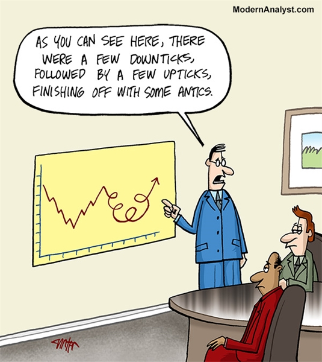<br>
<font style="font-size:10px">from <a href="https://www.modernanalyst.com/Resources/BusinessAnalystHumor/tabid/218/ID/3516/Data_Analysis_Conclusions.aspx">modernanalyst.com</a></font>
</p>

]


---

# Topics

.pull-left4[

<ul>
  <li class="m1"><span>Context</span></li>
  <br>
  <li class="m2"><span>Cognitive limitations</span></li>
  <ul class="level">
    <li><span>Reduce 'clutter'?</span></li>
    <li><span>Create order</span></li>
    <li><span>Give focus</span></li>
    <li><span>Leverage prior knowledge</span></li>
  </ul>
  <br>
  <li class="m3"><span>Graph types</span></li>
  <ul class="level">
    <li><span>Text, tables, charts</span></li>
    <li><span>Do's and dont's</span></li>
  </ul>
</ul>

]


.pull-right5[

<p align="center">
<br>
<font style="font-size:10px">from <a href="http://www.storytellingwithdata.com/">storytellingwithdata.com</a></font>
</p>

]


---

# What is the context?

.pull-left4[

<ul>
  <li class="m1"><span>Purpose</span></li>
  <ul class="level">
    <li><span>Exploration</span></li>
    <li><span><high>Explanation</high></span></li>
  </ul>
  <br>
  <li class="m2"><span>Audience</span></li>
  <ul class="level">
    <li><span>Prior knowledge</span></li>
    <li><span>Expectations</span></li>
  </ul>
</ul>

]

.pull-right5[

<p align="center">
<br>
<font style="font-size:10px">from <a href="">upbeatagency.com</a></font>
</p>

]

---

# Cognitive limitations

.pull-left4[

<ul>
  <li class="m1"><span><high>Memory-</high> and <high>attention span</high> of humans are limited.</span></li><br>
  <li class="m2"><span>Information processing is strongly influenced by:</span></li>
  <ul class="level">
    <span><li><high>Top-down</high>: expectations and prior knowledge</span></li>
    <span><li><high>Bottom-up</high>: visual characteristica</li></span>
  </ul>
  </span></li>
</ul>

]

.pull-right5[
<p align="center">
<br>
<font style="font-size:10px">from <a href="https://www.pinterest.de/pin/458311699553074413/?lp=true">pinterest.de</a></font>
</p>
]

---

# Cognitive limitations

.pull-left4[

<ul>
  <li class="m1"><span><high>Memory-</high> and <high>attention span</high> of humans are limited.</span></li><br>
  <li class="m2"><span>Information processing is strongly influenced by:</span></li>
  <ul class="level">
    <span><li><high>Top-down</high>: expectations and prior knowledge</span></li>
    <span><li><high>Bottom-up</high>: visual characteristics</li></span>
  </ul>
  </span></li>
</ul>

]

.pull-right5[
<p align="center">
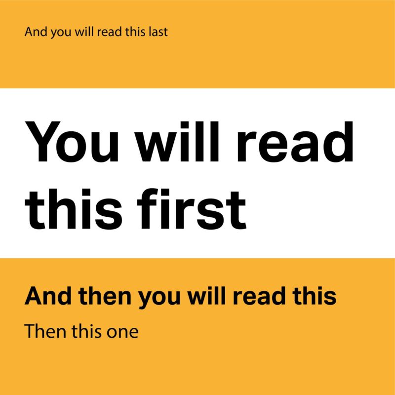<br>
</p>
]

---

# Cognitive limitations

.pull-left4[

<ul>
  <li class="m1"><span><high>Memory-</high> and <high>attention span</high> of humans are limited.</span></li><br>
  <li class="m2"><span>Information processing is strongly influenced by:</span></li>
  <ul class="level">
    <span><li><high>Top-down</high>: expectations and prior knowledge</span></li>
    <span><li><high>Bottom-up</high>: visual characteristics</li></span>
  </ul>
  </span></li>
</ul>

]

.pull-right5[
<p align="center">
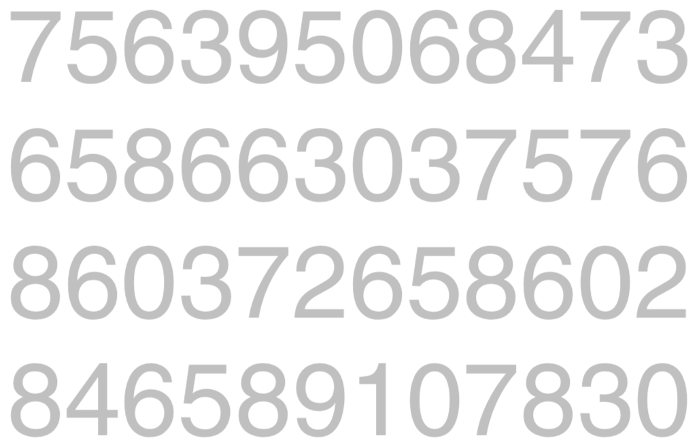<br>
<font style="font-size:10px">adapted from <a href="http://www.storytellingwithdata.com/">storytellingwithdata.com</a></font>
</p>
]


---

# Cognitive limitations

.pull-left4[

<ul>
  <li class="m1"><span><high>Memory-</high> and <high>attention span</high> of humans are limited.</span></li><br>
  <li class="m2"><span>Information processing is strongly influenced by:</span></li>
  <ul class="level">
    <span><li><high>Top-down</high>: expectations and prior knowledge</span></li>
    <span><li><high>Bottom-up</high>: visual characteristics</li></span>
  </ul>
  </span></li>
</ul>

]

.pull-right5[
<p align="center">
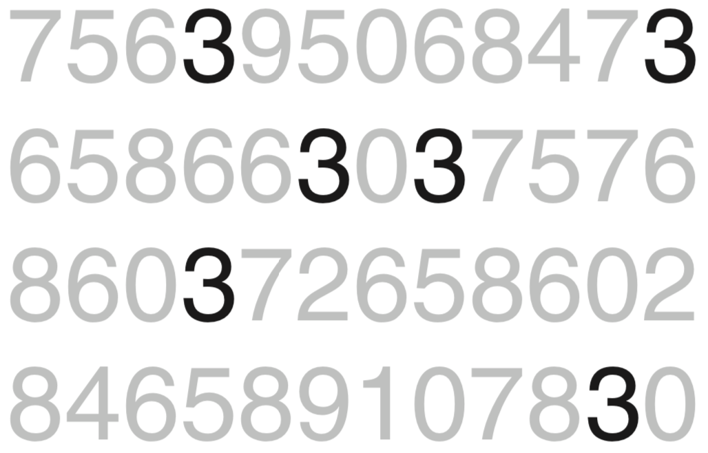<br>
<font style="font-size:10px">adapted from <a href="http://www.storytellingwithdata.com/">storytellingwithdata.com</a></font>
</p>
]


---

# Gestalt Psychology

.pull-left4[

<ul>
  <li class="m1"><span><high>Gestalt ~ Shape </high></span></li>
  <li class="m2"><span><high>Austrian / German</high> Psychology</span></li>
  <li class="m3"><span>Started <high>late 19th century<high></span></li>
</ul>

]

.pull-right5[


The mind perceives objects as <high>organized wholes</high> rather than <high>separate parts</high>.
]


---


# Gestalt Psychology

.pull-left4[

<ul>
  <li class="m1"><span><high>Gestalt ~ Shape </high></span></li>
  <li class="m2"><span><high>Austrian / German</high> Psychology</span></li>
  <li class="m3"><span>Started <high>late 19th century<high></span></li>
</ul>

]

.pull-right5[
The mind perceives objects as <high>organized wholes</high> rather than <high>separate parts</high>.
<center>

</center>
]

---

# Gestalt Psychology

.pull-left4[

<ul>
  <li class="m1"><span><high>reification</high></span></li>
<ul>
  <li>  experience more spatial information than is present</li>
</ul>
  <li class="m2"><span>emergence<high></high> </span></li>
<ul>
  <li> do not recognize componente (head, tail ...) </li>
</ul>
  <li class="m3"><span>Prägnanz (simplicity) <high><high></span></li>
  
  
</ul>

]

.pull-right5[

<center>

</center>
]

---

# Gestalt Psychology

.pull-left4[

<ul>
  <li class="m1"><span>reification</span></li>
  <ul>
  <li>  experience more spatial information than is present</li>
</ul>
  <li class="m2"><span><high>emergence</high> </span></li>
  <ul>
  <li> do not recognize componente (head, tail ...) </li>
</ul>
  <li class="m3"><span>Prägnanz (simplicity) <high><high></span></li>
</ul>

]

.pull-right5[

<center>
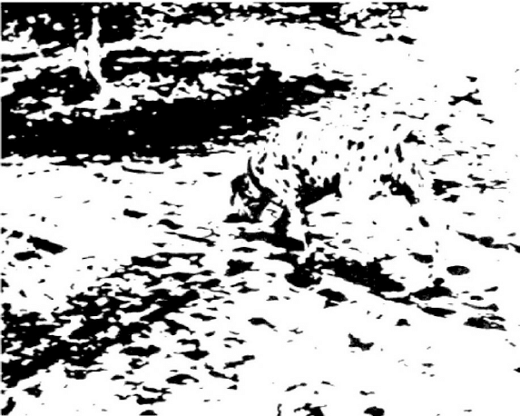
</center>
]

---

# Gestalt Psychology

.pull-left4[

<ul>
  <li class="m1"><span>reification</span></li>
  <ul>
  <li>  experience more spatial information than is present</li>
</ul>
  <li class="m2"><span><high>emergence</high> </span></li>
  <ul>
  <li> do not recognize componente (head, tail ...) </li>
</ul>
  <li class="m3"><span>Prägnanz (simplicity) <high><high></span></li>
</ul>

]

.pull-right5[
```{r echo = FALSE, fig.wdth=5, fig.height=5}
ggplot(circle, aes(x,y)) + 
  geom_point(color="black", size=2) + 
  coord_equal() +
  theme_minimal()
```

]


---

# Gestalt Psychology

.pull-left4[

<ul>
  <li class="m1"><span>reification</span></li>
  <ul>
  <li>  experience more spatial information than is present</li>
</ul>
  <li class="m2"><span>emergence<high></high> </span></li>
  <ul>
  <li> do not recognize componente (head, tail ...) </li>
</ul>
  <li class="m3"><span> <high>Prägnanz (simplicity)<high></span></li>
   <ul class="level">
    <li><span>regular</span></li>
    <li><span>simple</span></li>
    <li><span>orderly</span></li>
  </ul>
</ul>

]

.pull-right5[
```{r echo = FALSE, fig.wdth=5, fig.height=5}
ggplot(circle, aes(x,y)) + 
  geom_point(color="black", size=2) + 
  coord_equal() +
  theme_minimal()
```

]


---


# Law of ...

.pull-left4[

<ul>
  <li class="m1"><span><high>closure</high></span></li>
  <li class="m2"><span> continuity</span></li>
  <li class="m3"><span>similarity</span></li>
  <li class="m4"><span>proximity</span></li>
</ul>

]

.pull-right5[
```{r echo = FALSE, fig.wdth=5, fig.height=5}
ggplot(circle, aes(x,y)) + 
  geom_point(color="black", size=2) + 
  coord_equal() +
  theme_minimal()
```

]


---


# Law of ...

.pull-left4[

<ul>
  <li class="m1"><span>closure</span></li>
  <li class="m2"><span><high> continuity</high></span></li>
  <li class="m3"><span>similarity</span></li>
  <li class="m4"><span>proximity</span></li>
</ul>

]

.pull-right5[

```{r echo = FALSE, fig.wdth=5, fig.height=5}
mtcars <- mtcars %>%
  mutate(model=rownames(mtcars))

mtcars$model2<-factor(as.character(mtcars$model))
ggplot(mtcars, aes(x=mpg, y=model2)) + 
  geom_point(color="black") + 
  theme_bw() + ylab(NULL)
```


]
 

---


# Law of ...

.pull-left4[

<ul>
  <li class="m1"><span>closure</span></li>
  <li class="m2"><span><high> continuity</high></span></li>
  <li class="m3"><span>similarity</span></li>
  <li class="m4"><span>proximity</span></li>
</ul>

]

.pull-right5[

```{r echo = FALSE, fig.wdth=5, fig.height=5}
mtcars <- mtcars %>%
  mutate(model=rownames(mtcars))

ggplot(mtcars, aes(x=mpg, y=reorder(model, mpg))) + 
  geom_point(color="black") + 
  theme_bw() + ylab(NULL)
```


]
 

---


# Law of ...

.pull-left4[

<ul>
  <li class="m1"><span>closure</span></li>
  <li class="m2"><span><high> continuity</high></span></li>
  <li class="m3"><span>similarity</span></li>
  <li class="m4"><span>proximity</span></li>
</ul>

]

.pull-right5[

```{r echo = FALSE, fig.wdth=5, fig.height=5}
ggplot(mtcars, aes(wt, mpg)) + 
  geom_point(color="black", size = 5) + 
  xlab("weight (1,000 lbs)")+ 
  theme_bw() 
```


]
 

---

# Law of ...

.pull-left4[

<ul>
  <li class="m1"><span>closure</span></li>
  <li class="m2"><span>continuity</span></li>
  <li class="m3"><span><high> similarity</high></span></li>
  <li class="m4"><span>proximity</span></li>
</ul>

]

.pull-right5[

```{r echo = FALSE, fig.wdth=5, fig.height=5}
# Make number of cylinders a factor, so ggplot will choose a discrete scale.
mtcars$cyl<-factor(mtcars$cyl)

ggplot(mtcars, aes(wt, mpg)) + 
  geom_point(aes(color=cyl), size = 5) + 
  xlab("weight (1,000 lbs)") +
  scale_color_brewer("Cylinders", type="qual", palette=1) +
  theme_bw()
```


]
 

---


# Law of ...

.pull-left4[

<ul>
  <li class="m1"><span>closure</span></li>
  <li class="m2"><span>continuity</span></li>
  <li class="m3"><span><high> similarity</high></span></li>
  <li class="m4"><span>proximity</span></li>
</ul>

]

.pull-right5[

```{r echo = FALSE, fig.wdth=5, fig.height=5}
ggplot(mtcars, aes(wt, mpg)) + 
  geom_point(aes(shape=cyl), color="black", size = 5) + 
  xlab("weight (1,000 lbs)") +
  scale_shape("Cylinders")+
  theme_bw()
```


]
 

---

# Law of ...

.pull-left4[

<ul>
  <li class="m1"><span>closure</span></li>
  <li class="m2"><span>continuity</span></li>
  <li class="m3"><span><high> similarity</high></span></li>
  <li class="m4"><span>proximity</span></li>
</ul>

]

.pull-right5[

```{r echo = FALSE, fig.wdth=5, fig.height=5}
ggplot(mtcars, aes(wt, mpg)) + 
  geom_point(aes(shape=cyl), color="black", size = 5) + 
  xlab("weight (1,000 lbs)") +
  scale_shape_manual("Cylinders", values = c(1,2,3))+
  theme_bw()
```


]

---

# Law of ...

.pull-left4[

<ul>
  <li class="m1"><span>closure</span></li>
  <li class="m2"><span>continuity</span></li>
  <li class="m3"><span><high> similarity</high></span></li>
  <li class="m4"><span>proximity</span></li>
</ul>

]

.pull-right5[

```{r echo = FALSE, fig.wdth=5, fig.height=5}
ggplot(mtcars, aes(wt, mpg)) + 
  geom_point(aes(shape=cyl), color="black", size=5) + 
  xlab("weight (1,000 lbs)") +
  scale_shape_manual("Cylinders",values = c(52,54,56)) +
  theme_bw()
```


]

---

# Law of ...

.pull-left4[

<ul>
  <li class="m1"><span>closure</span></li>
  <li class="m2"><span>continuity</span></li>
  <li class="m3"><span><high> similarity</high></span></li>
  <li class="m4"><span>proximity</span></li>
</ul>

]

.pull-right5[

```{r echo = FALSE, fig.wdth=5, fig.height=5}
ggplot(mtcars, aes(wt, mpg)) + 
  geom_point(aes(shape=cyl, color=cyl), size = 5) + 
  xlab("weight (1,000 lbs)") +
  scale_shape_manual("Cylinders", values = c(1,2,3)) +
  scale_color_brewer("Cylinders", type="qual", palette=1) +
  theme_bw()
```


]

---


# Law of ...

.pull-left4[

<ul>
  <li class="m1"><span>closure</span></li>
  <li class="m2"><span>continuity</span></li>
  <li class="m3"><span> similarity</span></li>
  <li class="m4"><span><high>proximity</high></span></li>
</ul>

]

.pull-right5[

```{r echo = FALSE, fig.wdth=5, fig.height=5}
ggplot(diamonds, aes(clarity, fill=cut, group=cut)) + 
  geom_bar(stat="count", position="dodge") +
  scale_y_continuous("Count") +
  theme_bw()
```


]

---

# Law of ...

.pull-left4[

<ul>
  <li class="m1"><span>closure</span></li>
  <li class="m2"><span>continuity</span></li>
  <li class="m3"><span> similarity</span></li>
  <li class="m4"><span><high>proximity</high></span></li>
</ul>

]

.pull-right5[

```{r echo = FALSE, fig.wdth=5, fig.height=5}
diamonds_summary2<-diamonds %>%
  group_by(clarity, cut) %>%
  summarize(n=length(clarity))

ggplot(diamonds_summary2, aes(clarity, n, color=cut, group=cut)) + 
  geom_line() + 
  geom_point() + 
  expand_limits(y=0) +
  scale_y_continuous("Count") +
  theme_bw()
```


]


---

# Reduce 'clutter'

.pull-left3[

<ul>
  <li class="m1"><span>Remove all <high>unnecessary</high> elements.</span></li>
  <li class="m2"><span><high>Empty spaces</high> in visualizations are as important as pauses in speaking.</span></li>
</ul>

]

.pull-right6[
<p align="center">
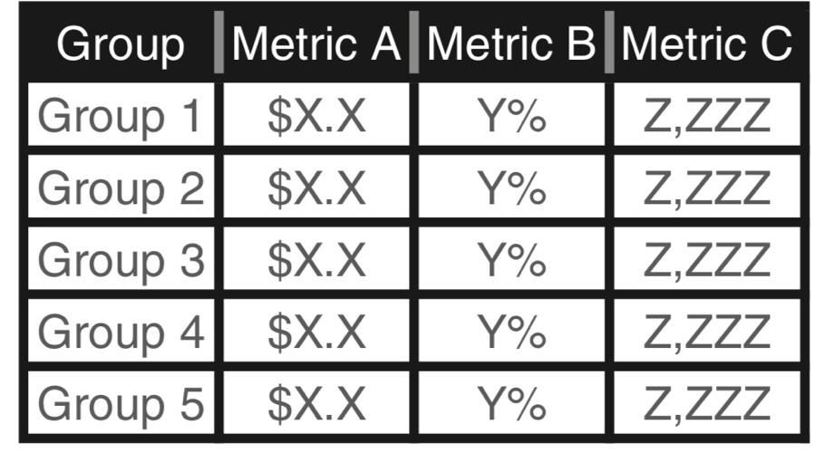<br>
<font style="font-size:10px">adapted from <a href="http://www.storytellingwithdata.com/">storytellingwithdata.com</a></font>
</p>
]

---

# Reduce 'clutter'

.pull-left3[

<ul>
  <li class="m1"><span>Remove all <high>unnecessary</high> elements.</span></li>
  <li class="m2"><span><high>Empty spaces</high> in visualizations are as important as pauses in speaking.</span></li>
</ul>

]

.pull-right6[
<p align="center">
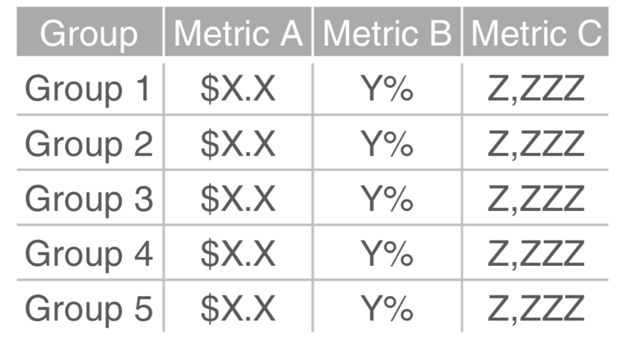<br>
<font style="font-size:10px">adapted from <a href="http://www.storytellingwithdata.com/">storytellingwithdata.com</a></font>
</p>
]

---

# Reduce 'clutter'

.pull-left3[

<ul>
  <li class="m1"><span>Remove all <high>unnecessary</high> elements.</span></li>
  <li class="m2"><span><high>Empty spaces</high> in visualizations are as important as pauses in speaking.</span></li>
</ul>

]

.pull-right6[
<p align="center">
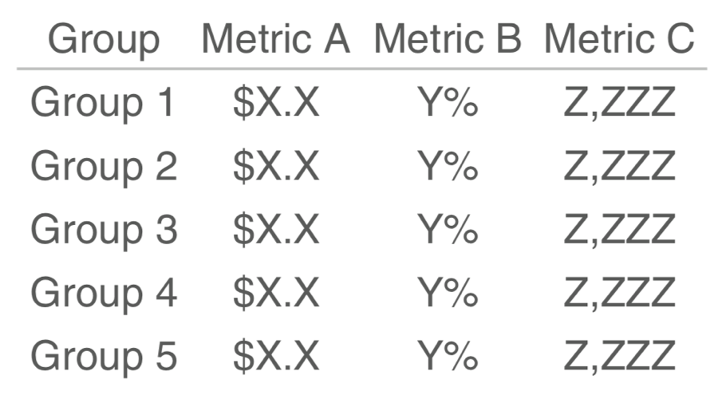<br>
<font style="font-size:10px">adapted from <a href="http://www.storytellingwithdata.com/">storytellingwithdata.com</a></font>
</p>
]


---

# Create order

.pull-left3[
<ul>
  <li class="m1"><span>Align elements along <high>implicit lines</high>.</span></li>
  <li class="m2"><span>Again: <high>Empty spaces</high> in visualizations are as important as pauses in speaking.</span></li>
</ul>
]

.pull-right6[
<p align="center">
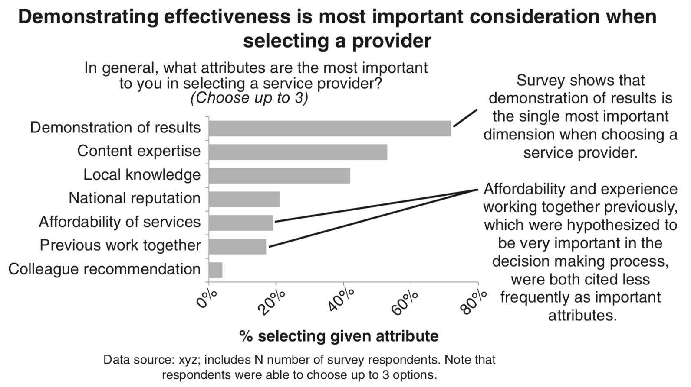<br>
<font style="font-size:10px">adapted from <a href="http://www.storytellingwithdata.com/">storytellingwithdata.com</a></font>
</p>
]

---

# Create order

.pull-left3[
<ul>
  <li class="m1"><span>Align elements along <high>implicit lines</high>.</span></li>
  <li class="m2"><span>Again: <high>Empty spaces</high> in visualizations are as important as pauses in speaking.</span></li>
</ul>
]

.pull-right6[
<p align="center">
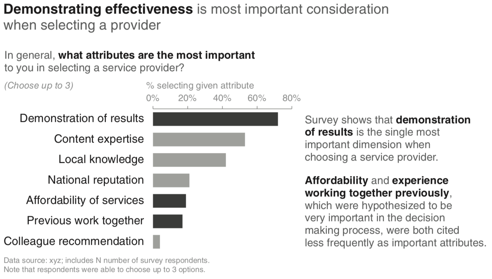<br>
<font style="font-size:10px">adapted from <a href="http://www.storytellingwithdata.com/">storytellingwithdata.com</a></font>
</p>
]

---

# Give focus

.pull-left3[
<ul>
  <li class="m1"><span>Use <high>few colors</high> and use them <high>strategically</high> (applies also to contrast).</span></li>
  <br>
  <li class="m2"><span>Choose colors that are <high>appropriate</high> and <high>pleasing</high>.</span></li>
  <ul class="level">
    <li><span>Tools: <a href="https://color.adobe.com/de/create">color.adobe.com</a> oder <a href="https://coolors.co/">coolors.co</a></span></li>
    <li><span>Farbsätze: <a href="https://cran.r-project.org/web/packages/viridis/vignettes/intro-to-viridis.html">viridis</a></span></li>
  </ul>
  <br>
  <li class="m3"><span>Be <high>consistent</high>.</span></li>
</ul>

]

.pull-right6[
<p align="center">
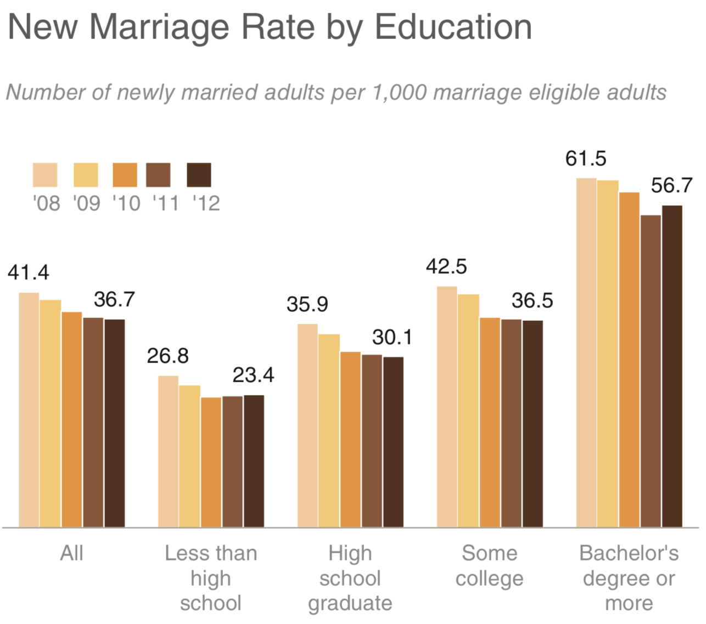<br>
<font style="font-size:10px">adapted from <a href="http://www.storytellingwithdata.com/">storytellingwithdata.com</a></font>
</p>
]


---

# Give focus

.pull-left3[
<ul>
  <li class="m1"><span>Use <high>few colors</high> and use them <high>strategically</high> (applies also to contrast).</span></li>
  <br>
  <li class="m2"><span>Choose colors that are <high>appropriate</high> and <high>pleasing</high>.</span></li>
  <ul class="level">
    <li><span>Tools: <a href="https://color.adobe.com/de/create">color.adobe.com</a> oder <a href="https://coolors.co/">coolors.co</a></span></li>
    <li><span>Farbsätze: <a href="https://cran.r-project.org/web/packages/viridis/vignettes/intro-to-viridis.html">viridis</a></span></li>
  </ul>
  <br>
  <li class="m3"><span>Be <high>consistent</high>.</span></li>
</ul>

]

.pull-right6[
<p align="center">
<br>
<font style="font-size:10px">adapted from <a href="http://www.storytellingwithdata.com/">storytellingwithdata.com</a></font>
</p>
]

---

# Give focus

.pull-left3[
<ul>
  <li class="m1"><span>Use <high>few colors</high> and use them <high>strategically</high> (applies also to contrast).</span></li>
  <br>
  <li class="m2"><span>Choose colors that are <high>appropriate</high> and <high>pleasing</high>.</span></li>
  <ul class="level">
    <li><span>Tools: <a href="https://color.adobe.com/de/create">color.adobe.com</a> oder <a href="https://coolors.co/">coolors.co</a></span></li>
    <li><span>Farbsätze: <a href="https://cran.r-project.org/web/packages/viridis/vignettes/intro-to-viridis.html">viridis</a></span></li>
  </ul>
  <br>
  <li class="m3"><span>Be <high>consistent</high>.</span></li>
</ul>

]

.pull-right6[
<p align="center">
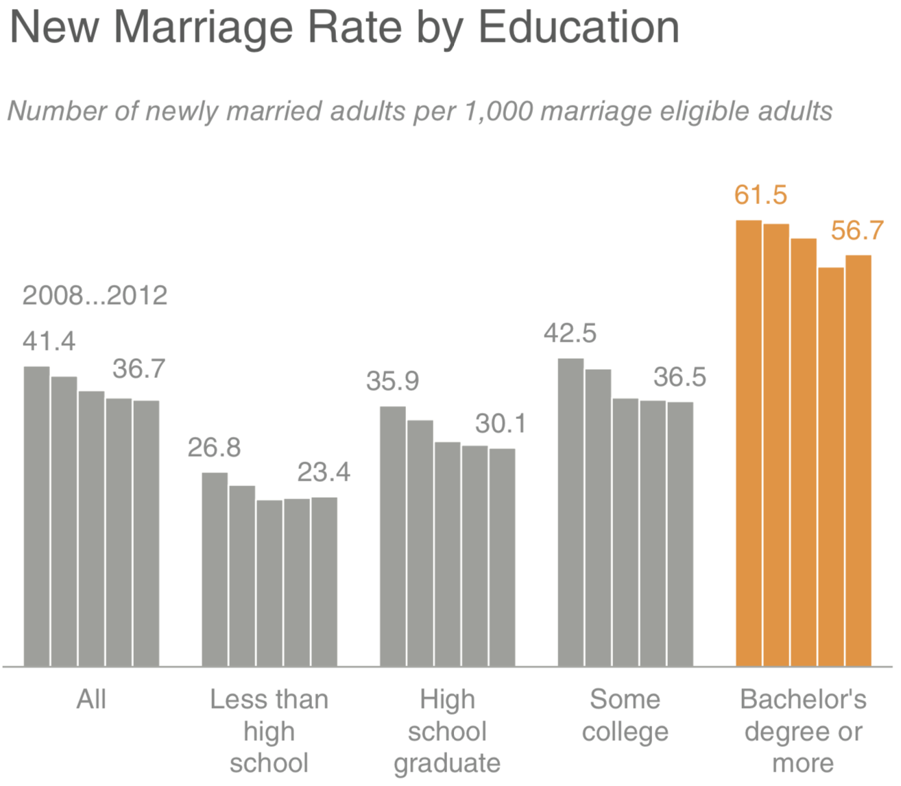<br>
<font style="font-size:10px">adapted from <a href="http://www.storytellingwithdata.com/">storytellingwithdata.com</a></font>
</p>
]


---

# Give focus

.pull-left3[
<ul>
  <li class="m1"><span>Use <high>few colors</high> and use them <high>strategically</high> (applies also to contrast).</span></li>
  <br>
  <li class="m2"><span>Choose colors that are <high>appropriate</high> and <high>pleasing</high>.</span></li>
  <ul class="level">
    <li><span>Tools: <a href="https://color.adobe.com/de/create">color.adobe.com</a> oder <a href="https://coolors.co/">coolors.co</a></span></li>
    <li><span>Farbsätze: <a href="https://cran.r-project.org/web/packages/viridis/vignettes/intro-to-viridis.html">viridis</a></span></li>
  </ul>
  <br>
  <li class="m3"><span>Be <high>consistent</high>.</span></li>
</ul>

]

.pull-right6[
<p align="center">
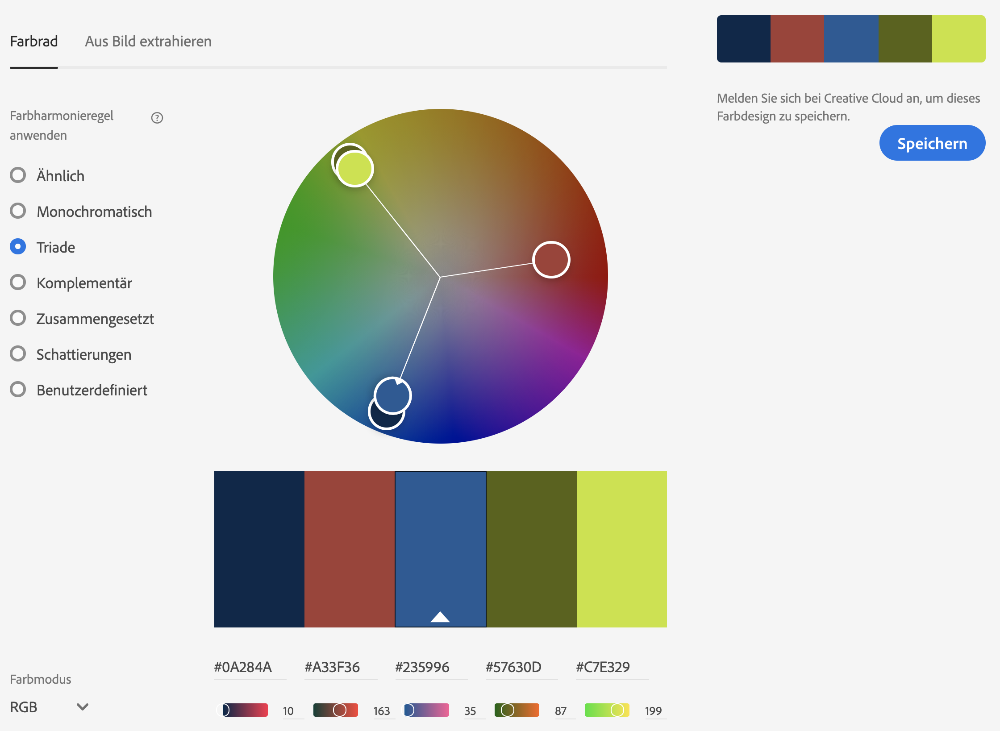<br>
<font style="font-size:10px">see <a href="https://color.adobe.com/de/create">color.adobe.com</a></font>
</p>
]

---

# Give focus

.pull-left3[
<ul>
  <li class="m1"><span>Use <high>few colors</high> and use them <high>strategically</high> (applies also to contrast).</span></li>
  <br>
  <li class="m2"><span>Choose colors that are <high>appropriate</high> and <high>pleasing</high>.</span></li>
  <ul class="level">
    <li><span>Tools: <a href="https://color.adobe.com/de/create">color.adobe.com</a> oder <a href="https://coolors.co/">coolors.co</a></span></li>
    <li><span>Farbsätze: <a href="https://cran.r-project.org/web/packages/viridis/vignettes/intro-to-viridis.html">viridis</a></span></li>
  </ul>
  <br>
  <li class="m3"><span>Be <high>consistent</high>.</span></li>
</ul>

]

.pull-right6[
<p align="center">
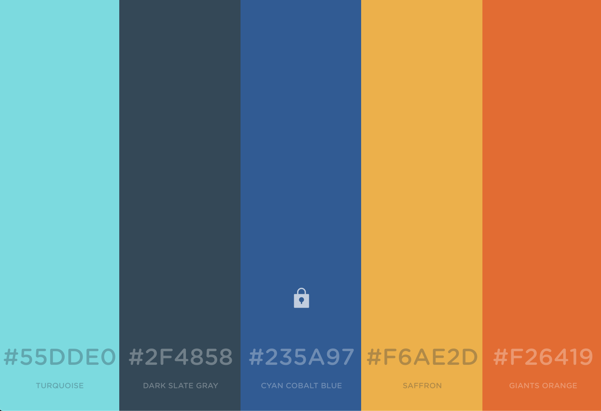<br>
<font style="font-size:10px">see <a href="https://coolors.co/">coolors.co</a></font>
</p>
]

---

# Text chart

.pull-left3[

<ul>
  <li class="m1"><span>If it is about a single number, present it as text.</span></li>
</ul>

]


.pull-right6[
<p align="center">
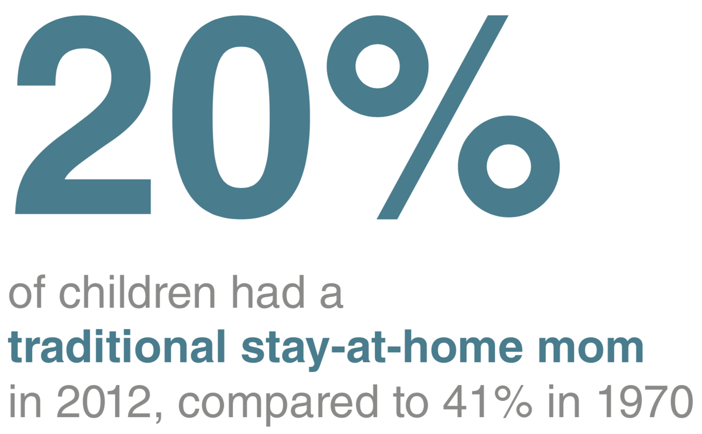<br>
<font style="font-size:10px">adapted from <a href="http://www.storytellingwithdata.com/">storytellingwithdata.com</a></font>
</p>

]

---

# Tables

.pull-left3[

<ul>
  <li class="m1"><span>Are <high>precise</high> and complete.</span></li>
  <li class="m2"><span>Are <high>processed serially</high> and need time.</span></li>
  <li class="m3"><span><high>Decluttered tables</high> are easier to read.</span></li>
  <li class="m4"><span><high>Colors</high> can help with giving focus.</span></li>
</ul>
]


.pull-right6[
<p align="center">
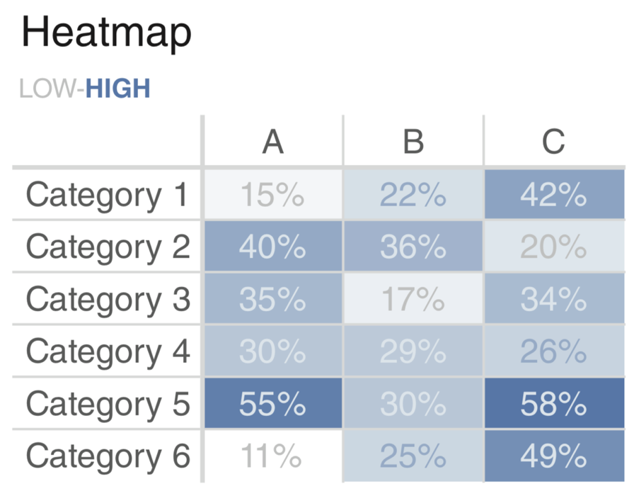<br>
<font style="font-size:10px">adapted from <a href="http://www.storytellingwithdata.com/">storytellingwithdata.com</a></font>
</p>

]

---

# Charts

.pull-left3[

<ul>
  <li class="m1"><span>Are <high>processed in parallel</high>.</span></li>
  <li class="m2"><span>Are often <high>easier to understand</high> than tables.</span></li>
  <li class="m3"><span>Are often <high>more difficult to create</high> than tables.</span></li>
</ul>

]


.pull-right6[
<p align="center">
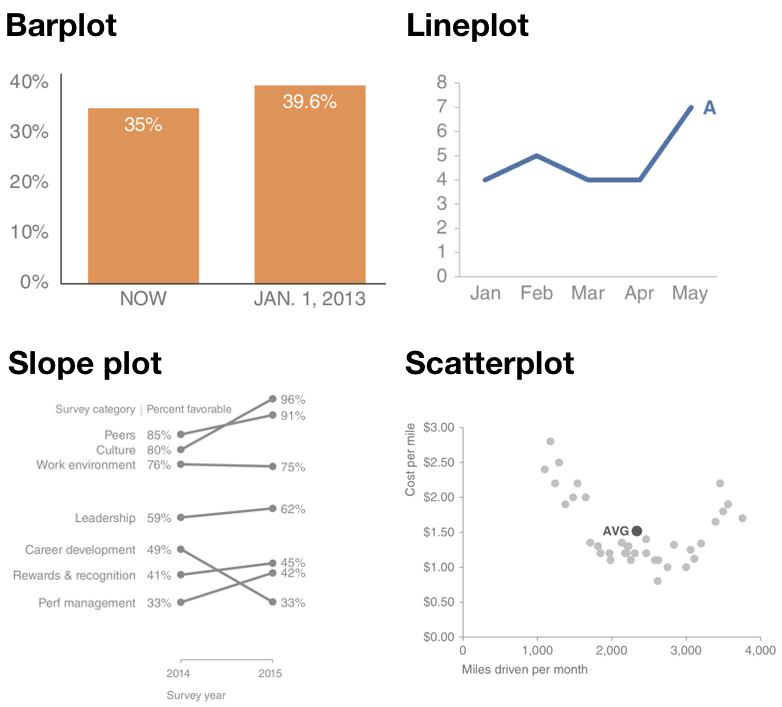<br>
<font style="font-size:10px">adapted from <a href="http://www.storytellingwithdata.com/">storytellingwithdata.com</a></font>
</p>

]

---

# Annotation

.pull-left3[

<ul>
  <li class="m1"><span>Annotation is <high>very important</high></span></li>
  <li class="m2"><span>Always useful:</span></li>
  <ul class="level">
    <li><span>Axes titles</span></li>
  </ul>
  <br>
  <li class="m3"><span>Mostly useful:</span></li>
  <ul class="level">
    <li><span>Plot title</span></li>
  </ul>
  <br>
  <li class="m4"><span>Often useful:</span></li>
  <ul class="level">
    <li><span>Subtitle</span></li>
    <li><span>Legend</span></li>
    <li><span>Annotations in the plot</span></li>
  </ul>
</ul>

]


.pull-right6[
<p align="center">

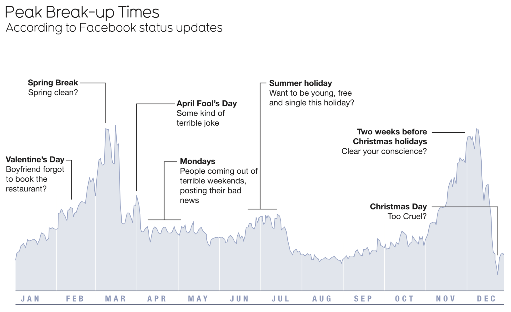<br>
<font style="font-size:10px">adapted from <a href="http://www.storytellingwithdata.com/">storytellingwithdata.com</a></font>
</p>

]


---

class: middle, center

<h1><a href="">Practical</a><br>What's wrong with this?</h1>


---

<br>
<p align="center">

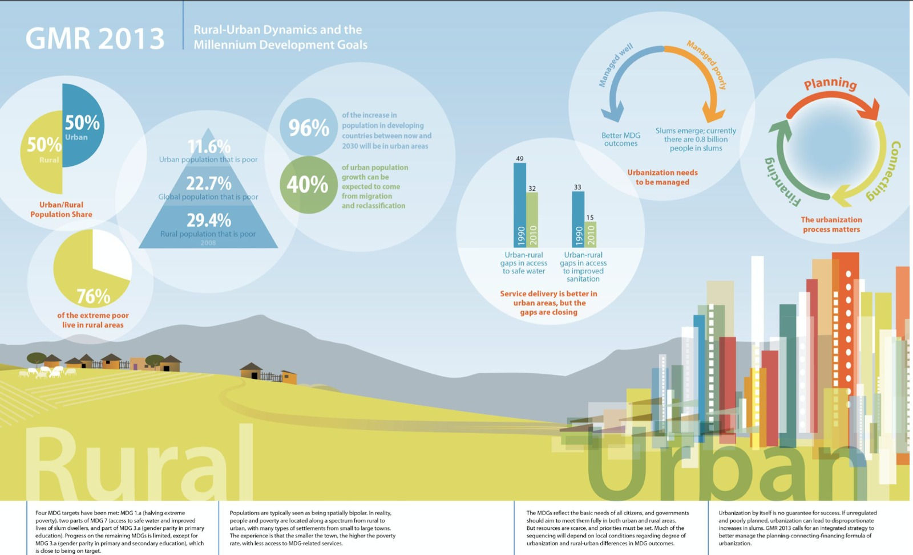<br>
<font style="font-size:10px">adapted from <a href="https://openknowledge.worldbank.org/handle/10986/13330">World Bank</a></font>
</p>


---

<br>
<p align="center">

<br>
<font style="font-size:10px">from <a href="https://showyourstripes.info/s/globe">Show your stripes</a></font>
</p>


---

<br>
<p align="center">

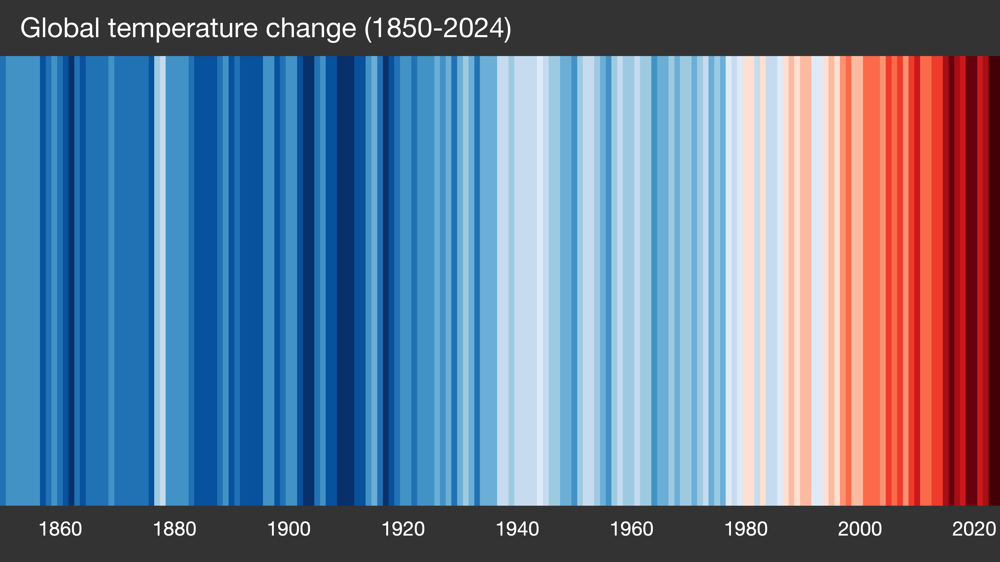<br>
<font style="font-size:10px">from <a href="https://showyourstripes.info/s/globe">Show your stripes</a></font>
</p>


---

<br>
<p align="center">

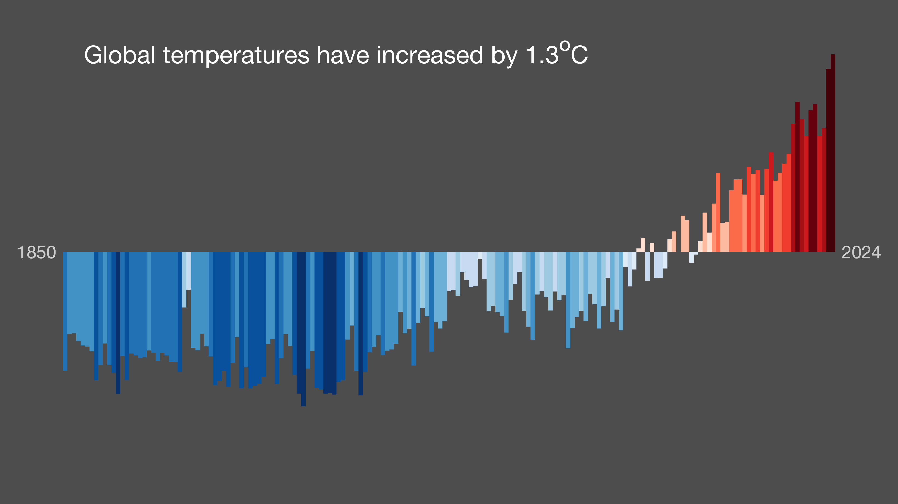<br>
<font style="font-size:10px">from <a href="https://showyourstripes.info/s/globe">Show your stripes</a></font>
</p>


---

<br>
<p align="center">

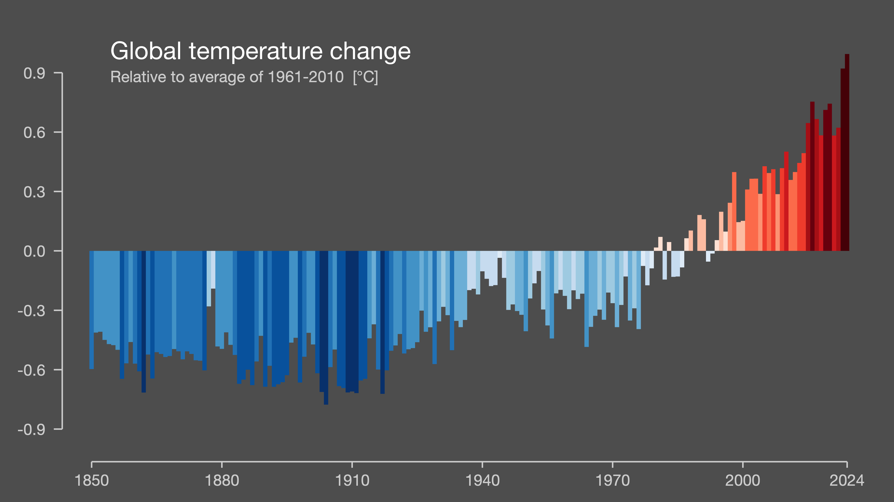<br>
<font style="font-size:10px">from <a href="https://showyourstripes.info/s/globe">Show your stripes</a></font>
</p>


---
class: middle, center

<h1>Pitches</h1>

---

# Pitches

.pull-left3[

<ul>
  <li class="m1"><span>Your <high>Sketch</high></span></li>
  <li class="m2"><span>2 slides - 2 Minutes</span></li>
  <li class="m3"><span>Discussion</span></li>
</ul>

]


.pull-right6[

In this session, you will introduce <high>your visualization sketch</high> to the rest of the group. 

You will have <high>2 slides and 2 minutes</high> for your pitch. 

Slide 1 should <high>only show a project title and an image</high> (e.g., from unsplash.com.) that helps you introduce and motivate your research question. 

Slide 2 should only show <high>your hand-drawn visualization sketch</high> and a slide title. No bullet points allowed. 

After each presentation there will be <high>3-5 minutes for peer feedback</high>, so please be prepared to comment on fellow participants’ presentations.

]


